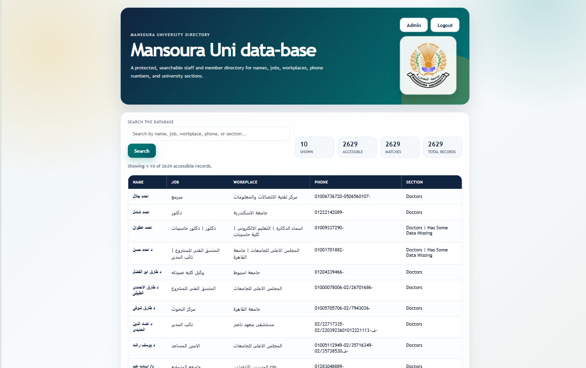

# Mansoura Uni Leaked Data-Base

A private, access-controlled Flask application for browsing an internal directory dataset. The repository is prepared so application code can be uploaded to GitHub and deployed on Vercel while sensitive JSON data, local users, and secrets stay out of the repo.


## Purpose

This app provides a protected search interface for approved users only. Access is managed by an administrator, and users can be assigned limited preview access or full access.

## ⚠️ DISCLAIMER

**IMPORTANT LEGAL NOTICE:**

This project is provided strictly for **educational and informational purposes only**. By accessing, using, or forking this repository, you acknowledge and agree to the following:

### Data Responsibility
- **The creator of this project is NOT responsible** for any misuse, unauthorized access, distribution, or illegal use of this data or application.
- **The original data was NOT obtained by the creator** of this project. The source dataset was provided externally.
- The creator does not claim ownership of the data and assumes no liability for its accuracy, completeness, or legality of its source.

### Legal Compliance
- Users are **solely responsible** for ensuring their use of this data and application complies with all applicable local, state, national, and international laws and regulations.
- Unauthorized access to or distribution of private data may violate privacy laws, data protection regulations (GDPR, CCPA, etc.), and criminal statutes.
- Users agree to use this project only in lawful and ethical ways.

### No Warranty
- This project is provided "AS-IS" without any warranties, express or implied.
- The creator makes no representations regarding the accuracy, reliability, or completeness of the data.
- The creator is not liable for any damages, losses, or consequences arising from the use of this project.

### Ethical Use
- If this data contains personal information of individuals who did not consent to its public exposure, users should consider the ethical implications of using it.
- Respect the privacy and rights of all individuals whose data may be included.

### Removal Request
If you believe your personal data is included in this project and should not be publicly available, please contact the repository owner immediately.

---

**By using this project, you assume all responsibility and liability for your actions.**



## Access Levels

- **Pending**: User has requested access and is waiting for admin approval.
- **Preview**: User can search and view only the first approved preview records.
- **Full**: User can view the full approved dataset.
- **Admin**: User can approve, contact, or delete access requests.

## Features

- Login-protected database browsing.
- Access request form for new users.
- Admin approval dashboard.
- Preview and full-access roles.
- Search by available record fields.
- Paginated results.
- Email notification support for new access requests.
- Vercel-ready Python entry point.

## Private Files

The real data files and local access records are intentionally not committed to GitHub.

Ignored by default:

```gitignore
Data/*.json
.env
.env.*
```

Use `.env.example` as a safe template for required environment variables.

## Local Setup

Install dependencies:

```bash
pip install -r requirements.txt
```

Run the app from the project root:

```bash
python App/app.py
```

Open locally:

```text
http://127.0.0.1:5000
```

If no `ADMIN_EMAIL` and `ADMIN_PASSWORD` are configured, create the first local admin at:

```text
http://127.0.0.1:5000/setup-admin
```

## Vercel Admin Login

For Vercel, create an admin account through environment variables instead of committing credentials.

Set these privately in Vercel Project Settings:

```env
SECRET_KEY=
ADMIN_EMAIL=
ADMIN_PASSWORD=
ADMIN_NAME=Admin
```

Use a strong unique password. Do not commit real admin credentials to GitHub.

## Email Notifications

To receive access request notifications, configure SMTP environment variables locally or in Vercel.

```env
APP_BASE_URL=
SMTP_HOST=
SMTP_PORT=587
SMTP_USERNAME=
SMTP_PASSWORD=
SMTP_FROM=
SMTP_USE_SSL=false
ACCESS_NOTIFICATION_RECIPIENTS=
```

For mail providers that require app passwords, use an app password instead of your normal account password.

## GitHub Upload Checklist

Before pushing:

- Confirm `.gitignore` includes private JSON and `.env` files.
- Confirm `Data/*.json` is not staged.
- Commit only code, assets, config, and safe examples.
- Keep the GitHub repo private unless you have moved all sensitive data to private storage.

Useful check:

```bash
git status
```

## Vercel Deployment

This repo includes:

- `vercel.json` for routing all requests to the Flask app.
- `api/index.py` as the Vercel Python entry point.
- `requirements.txt` for Python dependencies.
- `.vercelignore` to avoid uploading private local files from the CLI.

After importing the GitHub repo into Vercel:

- Add the environment variables from `.env.example`.
- Redeploy after changing environment variables.
- Log in with your configured `ADMIN_EMAIL` and `ADMIN_PASSWORD`.

## Data Storage Note

The app can boot on Vercel without the private dataset, but it will show an empty-data notice until a secure data source is connected or private data is provided through a safe deployment process.

Do not rely on local JSON writes for permanent production approvals on Vercel. Use a managed private database or storage service for production persistence.

Recommended production structure:

- GitHub: application code only.
- Vercel: deployment and environment variables.
- Private database/storage: sensitive records and access roles.
- Environment variables: secrets and mail credentials.

## Security Notes

- Do not commit real data.
- Do not commit `.env` or `.env.local`.
- Rotate credentials if they are accidentally exposed.
- Keep the repository private until production storage and access controls are fully configured.
- Review access requests before assigning preview or full access.

## Status

Private internal tool. Access is by approval only.

